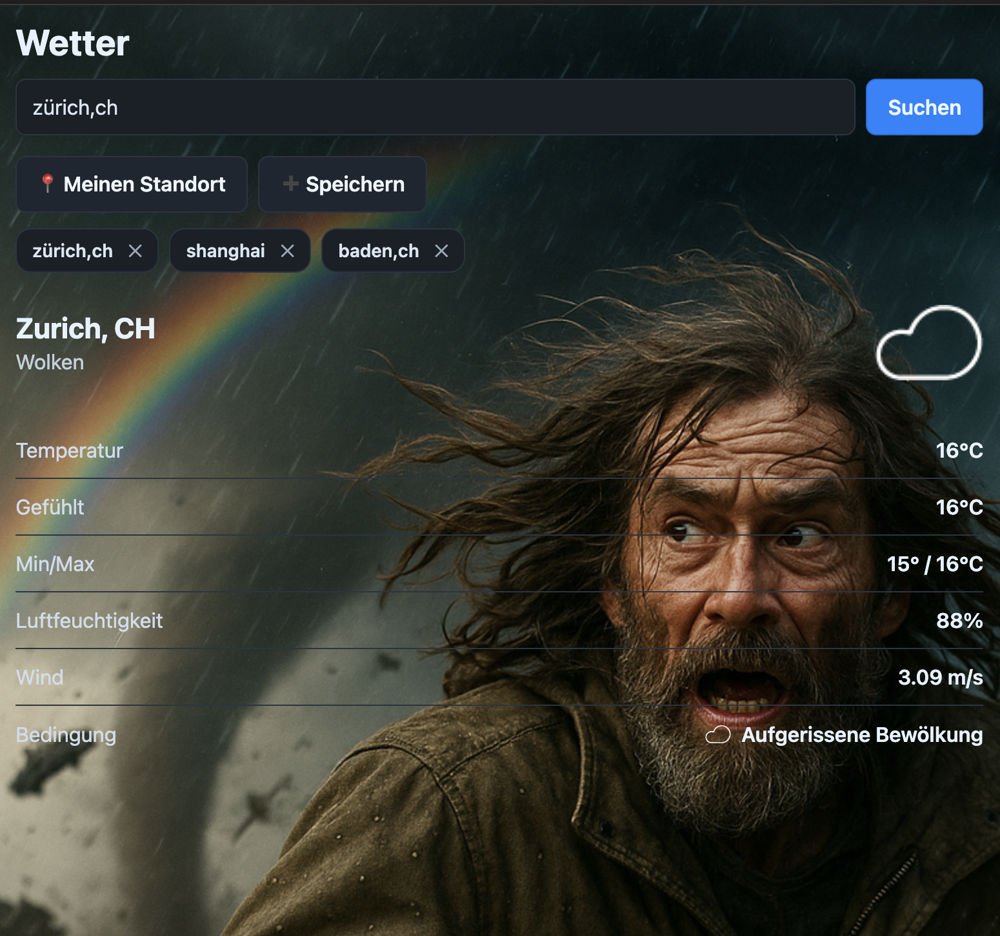

# Expo Weather App 🌤️

Built with OpenAI Codex



Eine moderne Wetter-App, entwickelt mit React Native und Expo, die aktuelle Wetterdaten für beliebige Städte weltweit anzeigt.

## Features ✨

- 🌍 Weltweite Wettersuche nach Städten
- 📍 **GPS-basierte Standortermittlung** - Automatisches Wetter für den aktuellen Standort
- 💾 **Persistente Standort-Speicherung** - Bis zu 5 zuletzt gesuchte Orte werden gespeichert
- 🌡️ Anzeige von Temperatur, Luftfeuchtigkeit und Windgeschwindigkeit
- 🎨 Dynamische Icons je nach Wetterlage (sonnig, bewölkt, regnerisch)
- 📱 Responsive Design für iOS, Android und Web
- 🇩🇪 **Vollständige deutsche Übersetzungen** für alle Wetterbedingungen
- ⚡ TypeScript für bessere Code-Qualität
- 🧪 Jest Testing Setup mit Coverage

## Screenshots 📱

Die App zeigt verschiedene Wettericons abhängig von den aktuellen Bedingungen:
- ☀️ Sonnig
- ☁️ Bewölkt  
- 🌧️ Regnerisch

### Neue Features
- 📍 **"Meinen Standort verwenden"** - Button für GPS-basierte Wetterabfrage
- 💾 **Gespeicherte Orte** - Schnellzugriff auf die letzten 5 gesuchten Standorte
- 🌐 **Deutsche Wetterbeschreibungen** - Alle Wetterbedingungen in deutscher Sprache

## Installation 🚀

### Voraussetzungen
- Node.js (Version 18 oder höher)
- npm oder yarn
- Expo CLI (`npm install -g @expo/cli`)
- **iOS/Android Gerät oder Emulator** für GPS-Funktionalität (nicht im Web verfügbar)

### Setup
1. Repository klonen oder Ordner herunterladen
2. In das Projektverzeichnis wechseln:
   ```bash
   cd expo-weather
   ```
3. Abhängigkeiten installieren:
   ```bash
   npm install
   ```

## Verwendung 💻

### Hauptfunktionen
1. **Manuelle Suche**: Geben Sie einen Städtenamen ein und drücken Sie "Suchen"
2. **GPS-Standort**: Klicken Sie auf "Meinen Standort verwenden" für automatische Standortermittlung
3. **Gespeicherte Orte**: Schnellzugriff auf Ihre letzten 5 gesuchten Standorte
4. **Standort speichern/entfernen**: Lange drücken zum Entfernen gespeicherter Orte

### Entwicklung starten
```bash
# Expo Development Server starten
npm start

# Spezifische Plattformen
npm run ios      # iOS Simulator
npm run android  # Android Emulator  
npm run web      # Web Browser
```

### Tests ausführen
```bash
# Tests mit Coverage ausführen
npm test

# TypeScript Typ-Checking
npm run typecheck

# Code Linting
npm run lint
```

## API-Konfiguration 🔧

Die App verwendet die OpenWeatherMap API. Der API-Schlüssel ist bereits konfiguriert, für Produktionsumgebungen sollte dieser jedoch durch einen eigenen ersetzt werden.

### Berechtigungen
- **Standort (GPS)**: Erforderlich für die "Meinen Standort verwenden" Funktion
- **Speicher**: Für das Speichern der bevorzugten Standorte

## Projektstruktur 📁

```
expo-weather/
├── App.tsx                 # Haupt-App-Komponente
├── assets/                 # Bilder und Ressourcen
│   ├── bg.png             # Hintergrundbild (optional)
│   └── img/               # Wetter-Icons
│       ├── sunny.png
│       ├── cloudy.png
│       └── rainy.png
├── __tests__/             # Test-Dateien
├── package.json           # Projekt-Konfiguration
├── app.json              # Expo-Konfiguration
└── tsconfig.json         # TypeScript-Konfiguration
```

## Technologien 🛠️

- **React Native**: Cross-Platform Mobile Development
- **Expo**: Entwicklungsumgebung und Build-Tools
- **TypeScript**: Statische Typisierung
- **OpenWeatherMap API**: Wetterdaten
- **expo-location**: GPS-Standortermittlung und Reverse Geocoding
- **@react-native-async-storage/async-storage**: Lokale Datenpersistierung
- **Jest**: Testing Framework
- **ESLint**: Code-Qualität

## Entwicklung 👨‍💻

### Neue Features im Detail

#### GPS-Standortermittlung
- Verwendet `expo-location` für präzise Standortbestimmung
- Automatisches Reverse Geocoding für lesbare Standortnamen
- Fehlerbehandlung für fehlende Berechtigungen
- Fallback auf manuelle Eingabe bei GPS-Problemen

#### Standort-Persistierung
- Speichert bis zu 5 zuletzt gesuchte Orte
- Verwendet AsyncStorage für plattformübergreifende Persistierung
- Automatisches Hinzufügen neuer Standorte
- Long-Press zum Entfernen gespeicherter Orte

#### Deutsche Übersetzungen
- Vollständige Übersetzung aller OpenWeatherMap Wetterbedingungen
- Unterstützt über 50 verschiedene Wetterzustände
- Fallback auf englische Originalbeschreibung bei unbekannten Zuständen

### Code-Qualität
Das Projekt verwendet ESLint mit Universe-Konfiguration für konsistente Code-Standards.

### Testing
Umfassende Test-Suite mit Jest und React Native Testing Library für zuverlässige Funktionalität.

### Unterstützte Plattformen
- iOS (iPhone & iPad) - **Vollständige GPS-Unterstützung**
- Android - **Vollständige GPS-Unterstützung**
- Web (Progressive Web App) - **Nur manuelle Suche und gespeicherte Orte**

**Hinweis**: Die GPS-Funktionalität ist nur auf mobilen Geräten verfügbar. Im Web-Browser funktionieren nur die manuelle Suche und gespeicherte Standorte.

## Lizenz 📄

Dieses Projekt ist für Bildungszwecke erstellt. Bitte beachten Sie die Nutzungsbedingungen der OpenWeatherMap API bei der Verwendung.

## Beitragen 🤝

Verbesserungen und Bugfixes sind willkommen! Bitte erstellen Sie einen Pull Request oder öffnen Sie ein Issue.
